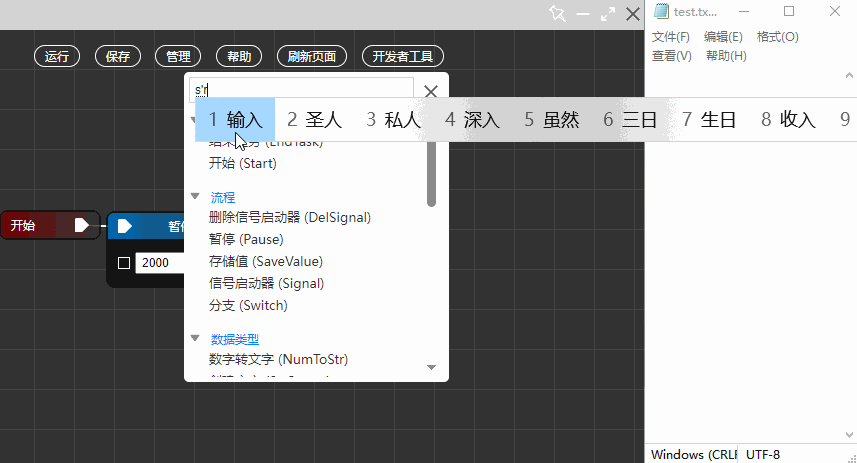

# 源核

「源核」是一款 Windows 平台下的效率工具，能够自动操控电脑键盘与鼠标。用户只需通过「可视化编程」的方式即可轻松创建自动化任务。

# 特点

- 仅支持 Windows 系统，依赖于系统的 webview（通常 Windows 自带）。
- 体积适中，应用大小约 30 MB。
- 绿色软件，无需安装，双击即用。
- 主要使用前端技术，易于二次开发。
- 丰富的节点，基本能够满足使用需求。
- 外部应用、脚本可通过发送 post 请求来调用该应用。
- 上手难度适中，只需了解一些基本概念，即可完全上手。
