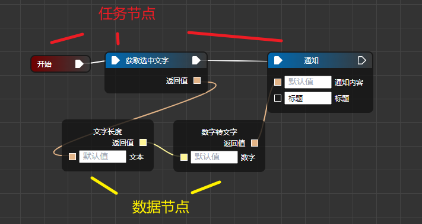

## 💡 快速上手

1. 下载好应用后，双击即可打开应用的主界面。

   主界面右上角的 5 个按键从左往右分别是：

- 使用帮助。
- 刷新页面。用于更新页面。
- 设置快捷键。可以给你编写的自动化任务绑定快捷键。
- 设置。设置工作路径，默认路径是桌面。建议更改一个路径，路径分隔符要使用 `\\`，例子：`C:\\Users\\users\\Desktop\\1`。
- 最小化到托盘。如果希望彻底关闭「源核」，请右击「源核」的托盘图标。

2. 打开「内置工具」中的「自动任务」。

鼠标右键打开「节点菜单」，并找到「开始」、「获取剪贴板」、「通知」这几个「功能节点」，点击以插入到画布，并按照下图的方式将各个节点连接起来：


点击左上角的「运行」，此时电脑会弹出一条通知，通知的内容正是你电脑剪贴板里的内容。此时你已经成功创建了一个任务。

> 🗨 Tip
>
> 1. 如果不小心连接错，只需双击用于连接的箭头即可取消连接。
> 2. 如果没有弹出通知，请检查一下电脑端口 `5030` 是否存在。若不存在，请关闭「源核」。等待数秒后再重新打开，看看能否正常运行。

分析一下上面的任务：

- 程序会根据箭头连接的顺序，依次执行各个节点的功能。
- 执行「获取剪贴板」后，获得了一个「返回值」。显而易见，这个「返回值」的就是电脑剪贴板的内容。如果我们没有将「返回值」连接到「通知内容」的前面，那么通知的内容将会是「123」。
- 如果我们没有给「通知」节点的「标题」参数提供值，「通知」节点会无法正常执行。这说明「标题」这个参数是必填的。有些节点的参数则是选填的，不填也不会导致节点运行失败。

> 🗨 Tip
>
> 1.  每个任务必须允许拥有一个「开始」。所有任务流程都必须从它开始出发。

3. 点击「保存」，之后点击「管理」。

我们能看到管理菜单会生成一个新的未命名「分组」和「任务」。重命名后，打开「源核」的主页面后，可以看到我们刚刚创建的任务。点击即可执行。

至此，我们已经了解了如何创建、保存、执行任务。下一步，我们给这个任务绑定快捷键。

## ⌨️ 设置快捷键

在主界面上点击 ⌨️ 按钮以打开「快捷键设置」界面。

在这个界面上，有个代码输入框，你只需要在里面输入相应的 AutoHotkey 2 代码，即可给任务绑定快捷键。（为毛能说的那么轻松啊？？？🤜）

不用担心，你无需编写那些恶心的代码，只需要点击右下角的「生成代码」，按照说明操作即可生成一段代码。只需要将生成的代码粘贴到代码输入框，再按「保存」即可完成绑定。

> 🗨 Tip
>
> 1.  信号名、信号内容这两项可以先不填写，后面用到时就明白是什么了。

上述方式，目前支持绑定的快捷键只能是「单键」、「多个修饰键+单键」。单键是指：`a`、`home` 之类的键，修饰键是指 `shift`、`ctrl`、`alt`、`win` 这 4 个键。即 `a`、`ctrl + a` 、`ctrl + alt + a` 都是可行的快捷键。

「源核」之所以保留这种奇怪的方式来绑定快捷键，是为了平衡「功能性」与「便捷性」。「源核」运行时，会读取「快捷键设置」界面里面的代码，生成并长期执行一个 AHK 2 脚本。在「参考信息」一节，我们提供了一些常用的 AHK 2 代码。

> 🗨 Tip
>
> 1.  AutoHotkey 2 是一种 Windows 平台下的脚本语言，虽然冷门，但是真的是提升效率的神器，同时上手难度不高，有空时不妨去了解一下。「源核」有相当多的节点都是靠它来实现。
> 2.  在「源核」注册了快捷键后，会导致原有快捷键的功能被占用。例如：在「源核」注册了 `ctrl + s`，之后我们在其它程序中按 `ctrl + s`，会发现 `ctrl + s` 无法用于保存文件。

## 🔬 详解「自动任务」

在前面，我们已经成功编写了一个自动任务。在这一节，我们来研究一下它。

### 功能节点与数据节点

「源核」提供了许多节点，这些节点可以分为两类：

- 「功能节点」，用于执行一个功能，例如：获取计算机剪贴板的内容。
- 「数据节点」，用于提供一个数据。



- 「功能节点」带有箭头，程序会根据箭头的指向来依次执行。
- 「数据节点」是纯黑色的，它不影响程序的执行顺序。

也就是说，上面的程序的执行顺序是：开始 → 获取鼠标选择的文字 → 发送通知。

而通知的内容，则由「数据节点」提供。通知内容是： 鼠标选择的文字的长度。

### 返回值与输入参数

以上图为例子。

- 节点右边的正方形接口 `⬜` 表示返回值，即节点执行完后的输出值。
- 节点右边的正方形接口 `⬜` 表示输入参数，即节点执行时的输入值。你也可以在节点的输入框里给节点提供一个默认的输入参数。当节点右边的 `⬜` 获取到输入参数时，默认参数将会被覆盖。

### 数据类型

对于计算机而言，数据是有类型的，例如：数字、文字。

之所以要将数据进行分类，是因为不同的数据有着不同的处理方式，例如：数字可以进行加减乘除的运算，而文字就不能。

在 「源核」中，连接节点的返回值、参数时，需要考虑数据的类型，数据类型不匹配时是无法连接的。「源核」目前的数据类型有：

- 文字
- 数字
- 数组
- 对象
- 特殊的数据类型，例如：思维导图对象

你无需特意去研究这些东西，只需简单了解它们。

- 文字、数字

这个很容易理解，不过有一点要注意，文字 1 和数字 1 看起来是一样的，不过这两者完全不等价。通常我们用 `'1'` 表示文字 1（用单引号或双引号包住以表示是文字）。

- 数组

数组可以一次性表示多份数据，它的结构类似于：`[1, 5, '9']`。这个数组的第 0 项的值是 1（也可以说为：数组的索引=0 时的值是 1），第 1 项的值是 5，第 2 项的值是文字 1（用引号包住的表示文字）。

从上面的例子可以看出，数组是有序的，且是从 0 开始。

- 对象

对象同样可以一次性表示多份数据，它的结构类似于：

```js
{
    "Windows 版本": "10.0.19045",
    "Windows 位数": "64 位",
    "分辨率": "1920×1080",
    "当前音量": "0%"
}
```

要从数组中取出数据，需要提供「索引」。而要从对象中取出数据，则需要提供"Windows 版本"、"Windows 位数"、"分辨率"、"当前音量"之类的「键」。

例如，该对象的「键」="分辨率"时，对应的「值」="1920×1080"。

## ✉️ 利用外部脚本启动自动任务

「源核」在开启后，会在本地开启一个 URL 为 `http://127.0.0.1:5030` 的服务器。

如果你希望用外部脚本来启动自动任务，只需要向 `http://127.0.0.1:5030/api/socket` 发送一个 post 请求，post 的 json 体见下：

```json
{
	"type": "runTask",
	"path": 任务的路径
}
```

> 🗨 Tip
>
> 1.  提供任务的路径，路径分隔符必须为 `\\`
> 2.  可以通过「快捷键设置」页面的「生成代码」获取到任务的路径

同上，如果你希望用外部脚本来发送信息，则 post 的 json 体见下：

```json
{
	"type": "sendData",
	"uuid": "信号名",
	"data": "信号内容"
}
```

### 例子

1. AHK 2

```AHK 2
; 执行任务 发起一个post请求 提供 js 文件路径
runTask(pa){
  API_URL := "http://127.0.0.1:5030/api/socket"
  HTTP_Request := ComObject("WinHttp.WinHttpRequest.5.1")
  HTTP_Request.Open("POST", API_URL, true)
  HTTP_Request.SetRequestHeader("Content-Type", "application/json")
  HTTP_Request.SetTimeouts(60000, 60000, 60000, 60000)

  ty := "runTask"
  pa := StrReplace(pa, "\", "\\")

  ; 最后一项结尾处不能有逗号，否则会报错
  res := "`{`n"
  . "`"type`":`"" ty "`",`n"
  . "`"path`":`"" pa "`"`n"
  . "`}"

  ; 会以字节字符串发送，记得在服务器端先将之转为普通字符串再转为json
  HTTP_Request.Send(res)
  HTTP_Request.WaitforResponse()
}
```

## 🧐 参考信息

这一节用于补充一些使用上的细节，以帮助用户更好的使用。

### 常用的 AHK 2 代码

1. 鼠标滚轮显示 / 隐藏「源核」

```AHK 2
; 点击鼠标滚轮中键，即可显示、隐藏主界面
MButton::
{
send("^+!{up}")
}
```

上面那段 AHK 2 代码的意思是：点击鼠标滚轮中键，相当于按下键盘的 `ctrl + alt + shift + n`。「源核」本身有且只有一个快捷键，就是 `ctrl + alt + shift + n`，用于显示、隐藏主界面。

> 🗨 Tip
>
> 1.  如果你希望用鼠标侧键来显示 / 隐藏，可以将 `MButton` 换为 `XMButton1`。

2. 连续快捷键

下面的代码可以设置快捷键：`ctrl + s + a` （持续按住 ctrl）。

```AHK 2
; 按住 Ctrl，然后按 alt + a
#HotIf GetKeyState("Ctrl", "P")
~s & a::{
  MsgBox "Hotkey activated."
}
```

### store. js

「源核」运行时，会在其所在文件目录生成一个 `store.js` 文件，这个文件用于存储数据。

这个文件记录了「源核」的配置。当你希望将「源核」移于新的电脑使用，记得将该文件与 `源核.exe` 一起移动。
