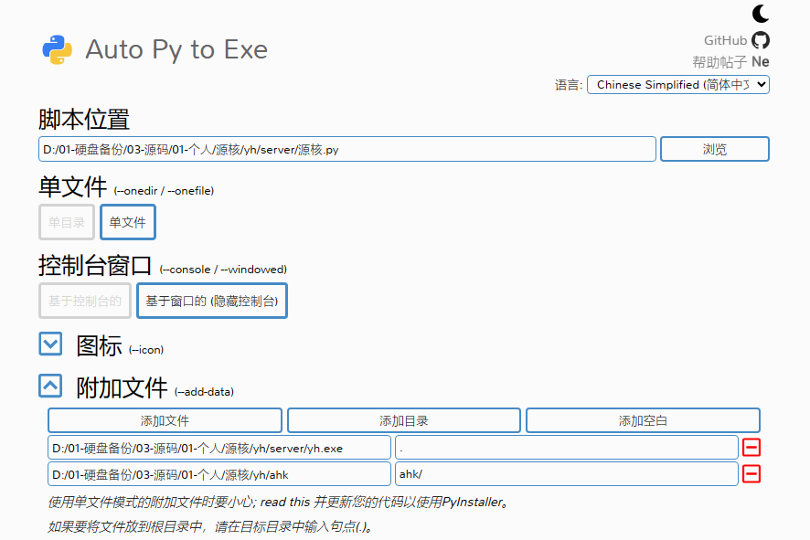

## 📣 项目简介

「源核」分前端、后端两部分。

### 前端

前端主要技术栈：TS + Webpack + Niva。

> 🗨 Tip
>
> 1.  Niva 可以近似理解为精简版 Electron，不过有不少区别。Niva 上手比较简单，它的概念都是沿用 Electron 的，很容易理解，不妨体验一下。如果不喜欢 Niva，也可修改源码进而改用 Electron。
> 2.  感谢 Niva 的开发者 🙏。

主要依赖包可查看 `package.json` 中的 `dependencies` 字段。下面是这些依赖包的简单介绍：

```
codemirror：代码编辑器。在「源核」的「快捷键设置」界面中用到。
thememirror：用于美化 codemirror。
lu2：一个无依赖 UI 库。
mousetrap：一个无依赖的前端快捷键库，可用于监听用户输入的按键。
simple-mind-map：一个不错的思维导图，无依赖。
```

### 后端

后端主要技术栈：Python + Flask + SocketIO + Pyautogui。

> 🗨 Tip
>
> 1.  「源核」还使用了 AutoHotkey 2 脚本来实现一些功能，如果不了解它，可以不用管，用 Python 同样可以实现这些功能。

下面是这些库的简单介绍：

```
Flask：用于开启一个本地服务器，进而实现 JS、Python、AHK 2 脚本的联动。
SocketIO：用于实现让服务器向客户端推送信息。
pyautogui：用 Python 操控鼠标键盘。
```

### 如何实现可视化编程

详见源码中 `GraphicProgramming` 部分。核心思路就是遍历节点 `Token` 并生成一段 JS 代码的字符串，最后利用 `new Function()` 生成函数并执行。

> 🗨 Tip
>
> 1.  `GraphicProgramming` 主要基于一个名为 Jsgp 的项目，我对其做了修改与拓展。
> 2.  感谢 Jsgp 的开发者 🙏。

### 如何实现通讯

「源核」中涉及到 3 种通讯：

- 客户端向服务器：发送 Post 请求。
- 服务器向客户端：利用 SocketIO 这个库。比 websocket、轮询方便，无需自己实现。
- 「源核」多个窗口间的通讯：详见 [Niva](https://bramblex.github.io/niva/) 的文档。

## ⚒️ 项目结构

```
├─ahk：AHK2 脚本
│  ├─启动器.ahk：「源核」启动后，会顺便执行这个脚本
│  ├─AutoHotkey64.exe：用于执行 AHK2 脚本
│  ├─functions.ahk：工具函数 ⭐
│  └─index.ahk ⭐
│
├─server：后端代码
│  ├─源核.py：相当于 index.py ，用于开启服务器 ⭐
│  ├─functions.py：工具函数 ⭐
│  └─yh.exe：将前端代码用 Niva 打包而成的 exe 文件
│
└─src：前端代码
   ├─assets：存放 svg 文件
   ├─GraphicProgramming：实现可视化编程，基于 Jsgp 项目
   │  ├─element：图形基类
   │  ├─graph：节点的外观 ⭐
   │  └─language_analysis：节点解析器。将节点转为 JS 代码 ⭐
   │     └─javascript
   ├─html：每个窗口对应的 html、ts 文件 ⭐
   ├─static：存放 .css
   ├─utils：工具函数
   ├─index.html：主界面的 html 文件 ⭐
   └─index.ts：主界面的 ts 文件 ⭐
```

> 🗨 Tip
>
> 1.  带有 ⭐ 的是比较重要的文件。

## 🏁 启动项目

1. 下载「源核」的源码，自行配置好 Webpack、 TS 开发环境

使用下面命令安装前端所有依赖：

```bash
npm install
```

如果仍然出现依赖缺失，请自行根据 `package.json` 中的 `dependencies` 字段手动安装。

使用下面命令启动项目：

```bash
npm start
```

默认使用 `http://localhost:8080/`。

2. 下载 Niva

目前我们已经能够在浏览器中看到运行中的项目，但我们实际开发时并不使用浏览器，而是使用 Niva。

Niva 是一个独立软件，你需要 [下载 Niva](https://bramblex.github.io/niva/) 并安装它。下载安装后，将「源核」导入到 Niva。

导入后它会询问你是否要新建一份 `niva.json` ，点击新建。之后可根据「源核」源码中的 `开发用 niva.json` 补充完整。

> 🗨 Tip
>
> 1. 「源核」源码中带有两份 niva. json ，一个用于开发，一个用于打包。两者的区别是，打包用的 niva. json 中带有路径相关的字段。Niva 开发时与打包时的路径有所不同，路径错误会导致项目启动失败。
> 2. niva. json 各个字段的含义请参考 Niva 窗口选项文档。

先运行 `npm run build` 编译出 `dist` 文件夹，再运行 `npm start` 启动项目，然后在 Niva 中点击调试，即可看到「源核」的窗口顺利弹出。

3. 自行配置好 Python 3 开发环境

> 🗨 Tip
>
> 1. 「源核」开发时使用了 Python 3.11.1。

使用下面命令安装后端所有依赖：

```bash
pip install -r requirements.txt
```

如果仍然出现依赖缺失，请自行根据报错内容进行安装。

Python 开发路径与打包路径不一样，因此开发前需要将所有使用了 `resource_path()` 的语句给注释掉。在打包时才取消注释。

此时执行 `源核.py`，即可启动一个本地服务器，端口号默认 `5030`。

至此，你已经成功启动该项目。

## 👨‍💻 开发一个内置工具

以「源核」自带的「思维导图」为例。

首先在 `src/html` 中新建 `MindMapping.html` 与 `MindMapping.ts`，然后在 `webpack.config.js` 中注册刚刚新建的页面。

> 🗨 Tip
>
> 1. 如果想了解更多，可自行查询「webpack 多页面开发」。

然后，我们在 `src/index.html` 中添加新的「内置工具」按钮，最后再在 `src/index.html` 中给这个按钮绑定事件。

> 🗨 Tip
>
> 1. 如果想开发一个类似于「思维导图」那样能够使用「任务节点」控制的「内置工具」，可以查看： `src/htmlMindMapping.ts`、`src/GraphiProgramming/graph/Mind.ts` 、`src/GraphiProgramming/language_analysis/javascript/Mind.ts` 这 3 份文件。

## 👨‍💻 开发一个节点

> 🗨 Tip
>
> 1.  大部分节点的功能实现，其实都是通过向服务器发送 post 请求，用 Python 来处理，之后再返回数据给客户端。
> 2.  节点的开发非常套路，只需要参考已有节点的源码即可。

参考下面两个文件即可：

- `src/GraphiProgramming/graph/Mind.ts`：定义节点的外观
- `src/GraphiProgramming/language_analysis/javascript/Mind.ts`：如何解析该节点

- 开发一个节点的外观后，需要在 `src\GraphicProgramming\graph_node_layout.ts` 中注册
- 开发一个节点的解析器后，需要在 `src\GraphicProgramming\language_analysis\index.ts` 中注册

## 🤖 打包成 exe

1. 使用 Niva 将前端代码打包成 exe

首先，运行 `npm run build` 将前端代码编译到 `dist` 文件中。

然后往 `dist` 文件中放入一张名为 `logo.png` 的照片作为 exe 的图标。

根据「源核」源码中的 `打包用 niva.json` 将现有的 `niva.json` 补充完整。这一步的目的主要是补充 `taskbarIcon` 、`icon` 字段，给 exe 提供图标。

之后在 Niva 中点击「构建」，打包成 `yh.exe`。然后将新打包出来的 `yh.exe` 替换掉源码中的 `server/yh.exe`。

2. 修改 Python 代码

Python 开发路径与打包路径不一样，因此打包前需要将所有涉及到路径的代码使用 `resource_path()` 进行处理。

这一步你只需要将 Python 代码中的被注释掉的使用了 `resource_path()` 的语句取消注释即可。

3. 打包 Python

打包 Python 通常使用 `Pyinstaller`，不过这里更加推荐使用 `auto-py-to-exe`。`auto-py-to-exe` 是一个基于 `Pyinstaller` 的打包工具，不仅提供可视化界面，而且帮我们避开 `Pyinstaller` 不少的坑。

使用下面命令安装 `auto-py-to-exe`：

```bash
pip install auto-py-to-exe
```

安装后输入下面命令启动：

```bash
auto-py-to-exe
```

打包选项：

- 单文件。脚本位置选择 `源核.py`
- 隐藏控制台
- .ico 图标。自己选一个，也可以使用源码中提供的图标
- 附加文件
  - 添加文件：前端打包出来的 `yh.exe`
  - 添加目录：`ahk` 这两个文件夹

可参考下图：



之后打包即可。

如果你是使用 `pyinstaller` 进行打包，可以参考下面代码：

```bash
pyinstaller --noconfirm --onefile --windowed
	--icon "D:/01-硬盘备份/03-源码/01-个人/源核/源核logo.ico"
	--add-data "D:/01-硬盘备份/03-源码/01-个人/源核/yh/server/yh.exe;."
	--add-data "D:/01-硬盘备份/03-源码/01-个人/源核/yh/ahk;ahk/"  "D:/01-硬盘备份/03-源码/01-个人/源核/yh/server/源核.py"
```

> 🗨 Tip
>
> 1.  Python 并不是一种易于打包的语言，若发生报错，请根据报错信息自己排查。

至此，你已经将「源核」顺利打包成 exe。

## 🧐 参考信息

这一节用于补充一些开发上的细节，以帮助开发者避坑。

### niva. json 文件模板

下面是一份打包时的 `niva. json` 文件：

```json
{
  "name": "yh",
  "uuid": "8d148e94-5a19-452d-a113-88aadf92fea5",
  "debug": {
    "resource": "dist", // 开发时的源文件
    "entry": "http://localhost:8080/"  // 开发时监听 8080 端口
  },
  "build": {
    "resource": "dist" // 打包时，使用 dist 文件
  },
  "window": {
    "title": "源核",
    "size":{
      "width": 300,
      "height": 400
    },
    "minSize": {
      "width": 300,
      "height": 400
    },
    "alwaysOnTop": true,
    "decorations": false,
    "taskbarIcon": "logo.png", // 以 dist 为根路径
    "devtools": true
  },
  "icon": "logo.png", // 以 dist 为根路径
  "shortcuts": [
    {
      "accelerator": "ctrl+shift+alt+up",
      "id": 0
    }
  ],
  "focused": false,
  "tray": {
    "icon": "logo.png", // 以 dist 为根路径
    "tooltip": "源核",
    "menu": [
      {
        "type": "item",
        "id": 1,
        "label": "显示窗口"
      },
      {
        "type": "item",
        "id": 2,
        "label": "退出"
      }
    ]
  }
} 
```
