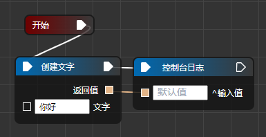
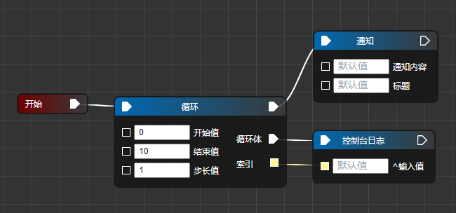
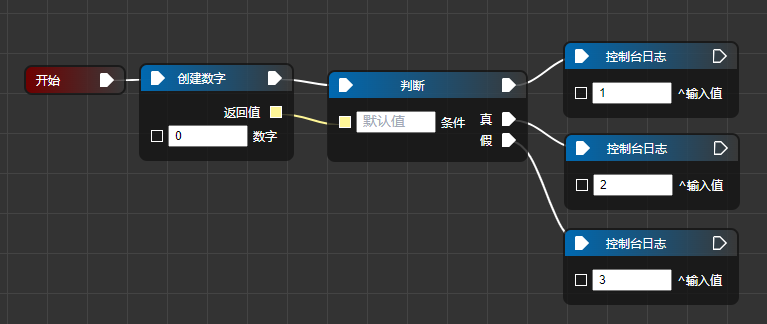
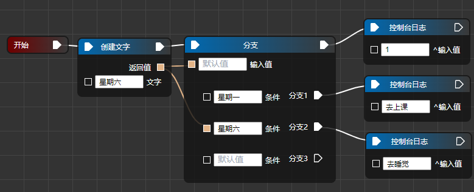
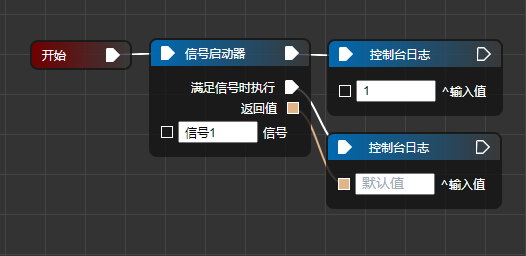
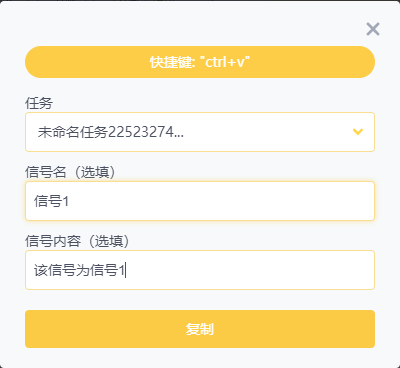

## 🌎 基础

### 结束任务

程序执行该节点后将会直接结束，不会继续运行。

### 控制台日志

将输入值打印到「控制台日志」。

这个节点非常有用，你可以用它来查看返回的数据值。

- 输入值（任意数据类型）

  输入值可以接受任意数据。

#### 例子



先点击「开发者工具」（或者按 `F12`），再执行这个任务，即可在开发者工具看到「你好」。

### 开始

它本身不执行任何功能，但每个任务必须从该节点开始，且该节点只允许拥有一个。

## 🔀 流程

### 循环

循环执行循环体，结束循环后再继续执行后面的节点。

比较复杂，不理解的可以直接看例子。

- 开始值、结束值、步长值（数字）

这 3 个参数决定了程序会执行几次循环体。具体含义详见例子。

- 循环体

需要循环执行的节点。

- 索引（数字）

具体含义详见例子。

#### 例子



打开「开发者工具」，执行上图任务。

上面的任务会在「开发者工具」中先后打印出：0、1、3……9（重复执行了 10 次「控制台日志」节点），然后弹出「结束」通知。

如果将开始值、结束值、步长值依次换为 0、10、2 再执行，程序会在「开发者工具」中先后打印出：0、2、4、6、8（重复执行了 5 次「控制台日志」节点），然后弹出「结束」通知。

### 判断

根据条件值是是真是假，决定执行真语句还是假语句，之后再继续执行后面的节点。

比较复杂，不理解的可以直接看例子。

- 条件（任意数据类型）

可以接受任意数据类型，但只有接受到数字 0 时才会被视为「假」，其余数据皆为「真」。

#### 例子



执行任务后会在「开发者工具」中先后打印出：3、1。

如果将「创建数字」中的数字换成 1，则执行任务后会在「开发者工具」中先后打印出：2、1。

### 分支

根据输入值去匹配条件，当输入值=条件时，执行对应的分支语句，之后再继续执行后面的节点。

比较复杂，不理解的可以直接看例子。

- 输入值（任意数据类型）
- 条件（任意数据类型）

#### 例子



执行任务后会在「开发者工具」中先后打印出：去睡觉、1。

### 注释

该节点没有任何功能，不影响任务执行，主要用于记录说明。

### 暂停

让程序暂停数毫秒后再执行。

- 暂停时间

单位 ms，1 秒=1000ms。

### 随机整数

生成一个区间为 `[最大值、最小值]` 的整数。

- 返回值（数字）
- 最小值（数字）
- 最大值（数字）

### 存储值

存储一个值。该节点允许你选择返回值的数据类型，因此你可以尝试用它来进行简单数据类型的转换。

- 值（任意数据类型）
- 返回值（任意数据类型）

### 信号启动器

程序执行到该节点后，会注册一个「信号监听器」，然后继续执行后面的节点。当用户发送「信号」时，会执行指定的程序。

- 满足信号时执行

在后面可连接「任务节点」，接收到信号后才会去执行。

- 返回值（文字）

信号内容。

- 信号（文字）

信号名。

> 🗨 Tip
>
> 1. 这个「信号监听器」会一直存在，直到用户主动删除它或关闭「源核」。因此，当注册多个信号监听器」时，建议每个信号名都要不一样。

#### 例子



执行任务后会在「开发者工具」中先后打印出：1。

然后在主界面中打开「快捷键设置」界面按照下面的方式注册一个快捷键：



现在我们按快捷键 `ctrl + v`，就能够发送信号名为「信号 1」的信号。重新查看刚刚程序的「开发者工具」，已经打印出「该信号为信号 1」。

### 删除信号启动器

删除信号名为 xx 的「信号监听器」。

- 信号（文字）

信号名。

## 🔢 数据类型

### 创建数字/ 文字

创建一个数字/ 文字。

### 数字转文字/ 文字转数字

例子：文字 1 转为数字 1。

如果文字不是一个阿拉伯数字，则无法成功转为一个数字。

### 创建数组

创建一个数组。

- 输入值（任意参数）

  点击「添加」即可添加多个输入值。

- 返回值（数组）

### 数组增加/ 删除/ 修改/ 获取 1 项

- 索引（数字）

  表示数组的第 n 项。例如：有 1 个数组是 `[1, 2, 3]` ，索引=1，则表示数组的 1 项，即数字 2。

- 修改内容/ 增加内容（任意数据类型）

### 对象增加/ 删除/ 修改/ 获取 1 项

- 返回值（对象）
- 键、值（数字、文字）

键、值建议输入数字或文字，如果输入值为数组、对象，可能存在未知 Bug。

> 🗨 Tip
>
> 1. 目前还没有「创建对象」这个节点。
> 2. 不了解「键」、「值」这两个概念的，可以参考「使用文档」里的介绍。

### 数据类型

传入数据，返回该数据的类型。

- 返回值（文字）
- 输入值（任意数据类型）

可能的返回值有：

- string，文字
- number，数字
- object，数组或对象

> 🗨 Tip
>
> 1.  object 既可能是数组，也可能是对象。具体是数组还是对象，要用「控制台日志」打印出来看一看。

## 🖱️ 键鼠操作

### 点击

模拟鼠标左键单击。提供坐标后，鼠标会移动到指定坐标的位置并左键点击 1 次。

- 屏幕位置（文字）

参数格式：`(517,401)`，表示屏幕的坐标 `(x,y)`。可选参数，如果不提供该参数，表示在原处点击。

想要获取鼠标在屏幕上的位置，可以使用「源核」内置工具中的「窗口信息」来获取。

### 移动鼠标

将鼠标移动到指定位置。

- 屏幕位置（文字）

参数格式：`(517,401)`。

### 图片中心坐标

提供一张照片的地址，该节点会查找电脑屏幕上是否有该图片，并返回该图片的中心坐标。

- 返回值（数组）

会返回一个数组，数组结构类似于：`[(23,62), (232,425), (467,37)]`。

- 文件路径（文字）

提供照片文件的路径，路径分隔符使用 `\\`，例如：`C:\\Users\\users\\Desktop\\1.png`。

支持常见的图片格式，比如 PNG、JPEG 照片。使用 `Python` 的 `pyautogui.locateAllOnScreen()` 函数实现。

### 获取鼠标处信息

获取鼠标处的信息。

- 返回值（对象）

对象类似于：

```js
{
    "xy": "(83,79)",
    "颜色": "#333333",
    "窗口标题": "自定义任务",
    "进程路径": "C:\\Users\\users\\Desktop\\NivaDevtools.exe",
    "窗口id": "5378084"
}
```

### 输入按键

模拟键盘输入。

- 文本（文字）

你想要输入的按键。

例如：

- `{Ctrl down}a`，表示按住 ctrl 再按下 a，等价于 `ctrl + a`
- `{Backspace}`，表示后退键
- `{MButton}`，表示鼠标中键
- ……

该节点是利用 AHK 2 中的 `send` 函数实现的，更多信息可参考 [发送 - 语法 & 使用 | AutoHotkey v2](https://zj1d.gitee.io/autohotkey/docs/commands/Send.htm#keynames)。

### 输入文字

如果鼠标已经聚焦到某一个输入框内，那么将会输入一段文字。

- 文本（文字）

你想要输入的内容。

## ✍ 文字

### 获取/ 写入/ 清空剪贴板

- 获取剪贴板返回值（文字）

返回剪贴版里面的文字内容。

- 写入剪贴板文本（文字）

往剪贴板里写入一些文字，就像 `ctrl + c` 一样。

清空剪贴板，把剪贴板内容清除。

### 连接文字

- 返回值（文字）
- 文本（文字）

可选参数。将文本 1、文本 2、文本 3 连接起来。

### 替换文字

- 返回值（文字）
- 原文（文字）
- 需替换文字（文字）
- 替换成（文字）

例子：原文为 `abcd`，需替换文字为 `a`，替换成 `b`，则返回值为 `bbcd`。若不提供替换参数，则返回值为 `bcd`。

### 删除文本

相当于按下 `Backspace` 键。

- 删除字数（数字）

要删除的字数。

### 获取选中文字

获取鼠标选择中的文字。

- 返回值（文字）

### 分割文本

根据分割符，将文本转为数组。

- 返回值（数组）
- 文本（文字）
- 分割符（文字）

例子：文本为 `1、2、3、4`，分割符为 `、` ，则返回值为 `[1, 2, 3, 4]`。

### 获取子字符串

获取文字从第 n 到第 m 个字符。

- 返回值（文字）
- 从第 n 个字符开始
- 到第 m 个字符结束

### 文字长度

返回一段文字的长度。

- 返回值（数字）
- 文本（文字）

## 💾 应用

### 获取当前窗口 id

每个应用窗口都会有一个对应的 id。根据窗口 id，我们可以获取到对应的窗口。

- 返回值（数字）

  > 🗨 Tip
  >
  > 1.  当把这个应用的窗口关闭后，重新打开该应用，此时这个应用的窗口 id 会改变。即窗口 id 并不是一个永久值。
  > 2.  可以用「源核」的内置工具「窗口信息」获取到当前窗口 id。

### 获取所有窗口 id

返回所有运行中应用的窗口 id。

- 返回值（数组）

### 切换窗口

将提供窗口 id，将活动窗口设置成对应窗口。

- 窗口 id（数字）

### 创建快捷方式

创建一个快捷方式在指定位置。

- 快捷方式名字（文字）
- 目标路径、生成位置（文字）。提供路径。路径分隔符使用 `\\`。

### 打开应用

打开一个应用。

- 应用路径（文字）

这个参数可以使用「源核」的内置工具「窗口信息」获取到。这个参数也可以叫做「进程路径」。

### 打开网页

使用默认浏览器打开指定网页。

- 网址（文字）

### 激活上一个窗口

相当于按下快捷键 `alt + esc`。

### 调整窗口透明度

- 窗口 id（数字）
- 透明度（数字）

取值为 `[0,255]`。值=0 时，窗口完全透明。

### 获取窗口信息

返回窗口信息对象。

- 窗口 id（数字）
- 返回值（对象）

对象内容如下：

```js
{
    "title": "自定义任务",
    "class": "Window Class",
    "exe": "NivaDevtools.exe",
    "pid": "23676",
    "进程路径": "C:\\Users\\users\\Desktop\\NivaDevtools.exe"
}
```

### 改变窗口状态

- 窗口 id（数字）
- 窗口状态

  - 原窗口状态。窗口最大、小化后，使用它可以恢复原来的尺寸。
  - 最小化
  - 最大化
  - 关闭
  - 打开/取消置顶。窗口置顶时使用，会取消置顶；没有置顶时使用，则会置顶窗口。

  > 🗨 Tip
  >
  > 1.  置顶窗口，意思是这个窗口始终不会被其它窗口给遮挡。

## 🖥️ 系统

### 获取磁盘信息

返回电脑硬盘的总空间与剩余空间，单位为 GB。

- 返回值（对象）

返回值的对象类似于：

```js
{
    "C盘总空间": "79.3",
    "C盘剩余空间": "7.2",
    "D盘总空间": "385.8",
    "D盘剩余空间": "125.8"
}
```

### 获取系统信息

返回系统的一些基本信息。

- 返回值（对象）

返回值的对象类似于：

```js
{
    "Windows 版本": "10.0.19045",
    "Windows 位数": "64 位",
    "分辨率": "1920×1080",
    "当前音量": "0%"
}
```

### 获取当前时间

返回当前时间。

- 返回值（对象）

返回值的对象类似于：

```js
{
    "年": "2024",
    "月": "02",
    "日": "26",
    "小时": "21",
    "分": "47",
    "秒": "17"
}
```

### 通知

在桌面右下角弹出一条通知。

- 通知内容（文字）
- 标题（文字）

### 关机

关机/ 重启/ 休眠。

### 音量调节

- 音量（文字）

例子：`50`：音量大小调节到 50。`+1`：音量大小增加 1。`-10`：音量大小减少 10。

## 💻 窗口

### 消息窗口

在鼠标位置生成一个简单的窗口，你可以复制里面的内容。

- 窗口内容（文字）

  > 🗨 Tip
  >
  > 1.  当鼠标点击到窗口外面的地方，该窗口就会自动消失，如果你希望这个窗口持续存在，请点击「钉在桌面上」。
  > 2.  只会存在 1 个消息窗口。当有新的消息窗口生成时，旧的窗口会自动消失。

### 表单窗口

生成一个表单窗口，当用户点击了表单窗口中的「确定」后，程序才会继续执行下去。若用户关闭了表单窗口，则不会继续执行。

- 返回值（对象）

  当用户点击了表单窗口中的「确定」后，才会返回一个值。建议使用「控制台日志」打印返回值查看。

- 输入参数（根据输入选项不同，接收不同类型的数据）
  - 文本（文字）：会在表单上显示输入的文字。
  - 输入框（文字）：会在表单上生成一个输入框。输入框里面的文字是输入的文字。
  - 多行文本框（文字）：生成一个比较大的输入框。
  - 单选（数组）：根据数组的值生成几个选项。建议数组里面的值数据类型为文字。
  - 多选（数组）：同上。
  - 下拉列表（数组）：同上。

## 📄 文件

### 读文件

读取文件的内容并返回。

注意：只能用于读取编码为 `UTF-8` 的文件。

- 文件路径（文字）

  提供文件的路径，路径分隔符使用 `\\`，例如：`C:\\Users\\users\\Desktop\\1`。

- 返回值（文字）

### 写文件

写入编码为 `UTF-8` 的内容到指定文件。

注意：写入的内容会将文件原有内容给覆盖掉，请小心使用。

- 文件路径（文字）
- 内容（文字）

  写入文件里面的文字。

## 🧠 思维导图

### 新建思维导图

弹出一个思维导图窗口。

新建思维导图后，这个思维导图是没有正在活动中的节点的。你可以在新建思维导图后使用「输入按键」，文本参数为 `{tab}`。这样就会自动生成一个子节点，从而有一个正在活动中的节点。

- 返回值（对象-思维导图）

返回一个对象，这个对象代表了思维导图。

### 获取激活节点

获取思维导图中正在活动的节点的 uid。

- 返回值（文字）
- 思维导图（对象-思维导图）

### 获取节点信息

提供思维导图的节点 uid，可获取节点的 uid、父节点的 uid、子节点、节点的内容。

- 返回值（对象）
  返回值的对象类似于：

```js
{
    "uid": "92038558-5cd2-4366-bbb7-1f526044bfc3",
    "父节点": "92807458-7b34-47ff-9404-3a8c9b021fe7",
    "子节点": [],
    "节点内容": "这个节点里面有一些内容",
    "节点层级": 1
}
```

- 思维导图（对象-思维导图）
- 节点 uid（文字）

可通过「获取激活节点」获得节点的 uid。

### 增加兄弟节点

在正在活动的中的节点增加一个同级节点。如果没有活动节点则直接跳过。

- 思维导图（对象-思维导图）
- 文字（文字）

新节点里面的内容。

### 增加子节点

在正在活动的中的节点后面增加一个子节点。如果没有活动节点则直接跳过。

- 思维导图（对象-思维导图）
- 文字（文字）

新节点里面的内容。

### 删除节点

删除正在活动的中的节点。如果没有活动节点则直接跳过。

- 思维导图（对象-思维导图）

### 修改节点

修改思维导图正在活动的中的节点的内容。如果没有活动节点则直接跳过。

- 思维导图（对象-思维导图）
- 文字（文字）
